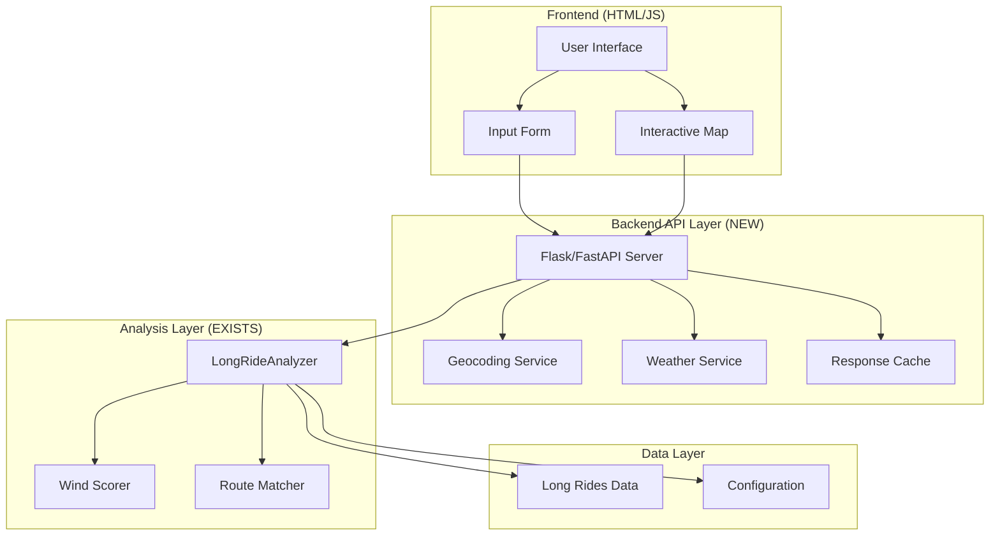

# Long Rides Feature - Comprehensive Redesign Plan

**Version:** 2.6.0  
**Status:** Design Phase  
**Priority:** High  
**Created:** 2026-03-29

---

## Executive Summary

The Long Rides feature has been partially implemented but requires a holistic redesign to become fully functional. This document provides a comprehensive analysis of the current state, identifies critical gaps, and presents a detailed implementation plan for a complete, production-ready feature.

### Current State Assessment

**What Exists:**
- ✅ Backend analyzer ([`src/long_ride_analyzer.py`](../../src/long_ride_analyzer.py)) with sophisticated wind scoring
- ✅ Route classification and grouping logic
- ✅ Wind analysis algorithm (70% weight on second half for tailwinds)
- ✅ Basic UI tab in HTML report
- ✅ Configuration options in [`config.yaml`](../../config/config.yaml)
- ✅ Test script ([`scripts/test_long_ride_recommendations.py`](../../scripts/test_long_ride_recommendations.py))

**What's Missing:**
- ❌ **No interactive functionality** - UI is static placeholder
- ❌ **No API endpoints** - No way to fetch recommendations dynamically
- ❌ **No weather integration** - Frontend can't get real-time weather
- ❌ **No geocoding** - Can't convert location input to coordinates
- ❌ **No route filtering** - Can't filter by roundtrip/point-to-point
- ❌ **No map visualization** - Routes aren't displayed on map
- ❌ **No parameter handling** - Time/distance filters not implemented
- ❌ **No error handling** - No user feedback for failures

---

## Problem Statement

Users cannot currently use the long rides feature because:

1. **Broken User Flow**: Clicking "Get Recommendations" does nothing
2. **Missing Backend Integration**: No API to connect frontend to backend logic
3. **Incomplete UI**: Form inputs exist but aren't wired up
4. **No Real-time Data**: Weather and geocoding happen at report generation, not on-demand
5. **Poor Mobile Experience**: Not optimized for mobile usage

---

## Design Goals

### 1. Functional Completeness
- Users can input starting location (text or map click)
- Users can specify ride parameters (time, distance, type)
- System fetches real-time weather and generates recommendations
- Results display with interactive maps and detailed analysis

### 2. User Experience Excellence
- Intuitive, self-explanatory interface
- Fast response times (<3 seconds for recommendations)
- Clear visual feedback during loading
- Mobile-first responsive design
- Graceful error handling with helpful messages

### 3. Backend Robustness
- Efficient route matching algorithms
- Accurate wind analysis
- Proper caching to minimize API calls
- Comprehensive error handling
- Scalable architecture

---

## Architecture Overview



---

## Detailed Component Design

### 1. Frontend Components

#### 1.1 Input Form Enhancement
**Location:** [`templates/report_template.html`](../../templates/report_template.html) (lines 1952-1974)

**Current State:**
```html
<input type="datetime-local" id="rideDateTime">
<input type="text" id="startLocation" placeholder="City, State or ZIP">
<button onclick="loadAndAnalyzeRoutes()">Get Recommendations</button>
```

**Required Changes:**
- Add ride type selector (roundtrip/point-to-point)
- Add distance range slider (15-100+ km)
- Add duration range slider (1-6+ hours)
- Add weather preference toggles
- Implement form validation
- Add loading states

**New UI Elements:**
```html
<!-- Ride Type Selection -->
<div class="btn-group" role="group">
  <input type="radio" name="rideType" id="roundtrip" value="roundtrip" checked>
  <label for="roundtrip">🔄 Roundtrip</label>
  <input type="radio" name="rideType" id="pointToPoint" value="point-to-point">
  <label for="pointToPoint">➡️ Point-to-Point</label>
</div>

<!-- Distance Range -->
<label>Target Distance</label>
<input type="range" id="distanceRange" min="15" max="100" value="40">
<span id="distanceValue">40 km</span>

<!-- Duration Range -->
<label>Target Duration</label>
<input type="range" id="durationRange" min="1" max="6" value="2" step="0.5">
<span id="durationValue">2.0 hours</span>
```

#### 1.2 Interactive Map Integration
**Location:** New JavaScript in [`templates/report_template.html`](../../templates/report_template.html)

**Features:**
- Click-to-select starting location
- Display recommended routes with color coding
- Show wind direction arrows
- Route preview on hover
- Zoom to selected route

**Implementation:**
```javascript
// Map click handler
map.on('click', function(e) {
    const lat = e.latlng.lat;
    const lon = e.latlng.lng;
    
    // Update form with coordinates
    document.getElementById('startLocation').value = `${lat.toFixed(4)}, ${lon.toFixed(4)}`;
    
    // Add marker
    if (startMarker) map.removeLayer(startMarker);
    startMarker = L.marker([lat, lon]).addTo(map);
    
    // Optionally auto-trigger search
    if (autoSearchEnabled) {
        loadAndAnalyzeRoutes();
    }
});
```

#### 1.3 Results Display Component
**Location:** New section in [`templates/report_template.html`](../../templates/report_template.html)

**Features:**
- Card-based layout for each recommendation
- Wind score visualization (progress bar + color coding)
- Route details (distance, duration, elevation)
- Weather summary with icons
- "View on Map" button
- "Get Directions" link to Strava

**Design:**
```html
<div class="recommendation-card" data-route-id="123">
  <div class="card-header">
    <h4>Route Name</h4>
    <span class="wind-score-badge">0.85</span>
  </div>
  <div class="card-body">
    <div class="wind-score-bar">
      <div class="score-fill" style="width: 85%; background: #28a745;"></div>
    </div>
    <div class="route-metrics">
      <span>📏 42.5 km</span>
      <span>⏱️ 2.1 hours</span>
      <span>⛰️ 245m gain</span>
    </div>
    <div class="weather-summary">
      <span>🌬️ 15 km/h SW</span>
      <span>🌡️ 22°C</span>
      <span>☀️ Clear</span>
    </div>
    <p class="recommendation-text">
      Excellent! Headwind out, strong tailwind back - perfect for a long ride
    </p>
  </div>
  <div class="card-footer">
    <button onclick="showRouteOnMap(123)">🗺️ View on Map</button>
    <a href="https://strava.com/activities/123" target="_blank">🔗 View on Strava</a>
  </div>
</div>
```

### 2. Backend API Layer (NEW)

#### 2.1 API Server Setup
**Location:** New file `src/api/long_rides_api.py`

**Framework Choice:** Flask (lightweight, easy to integrate)

**Endpoints:**

##### GET `/api/long-rides/recommendations`
**Purpose:** Get ride recommendations based on parameters

**Query Parameters:**
- `lat` (required): Starting latitude
- `lon` (required): Starting longitude
- `ride_type` (optional): "roundtrip" or "point-to-point"
- `min_distance` (optional): Minimum distance in km
- `max_distance` (optional): Maximum distance in km
- `min_duration` (optional): Minimum duration in hours
- `max_duration` (optional): Maximum duration in hours
- `datetime` (optional): ISO format datetime for weather forecast

**Response:**
```json
{
  "status": "success",
  "location": {
    "lat": 41.8781,
    "lon": -87.6298,
    "name": "Chicago, IL"
  },
  "weather": {
    "wind_speed_kph": 15,
    "wind_direction_deg": 225,
    "temperature_c": 22,
    "conditions": "Clear"
  },
  "recommendations": [
    {
      "ride_id": 123,
      "name": "Lakefront Trail Loop",
      "distance_km": 42.5,
      "duration_hours": 2.1,
      "elevation_gain_m": 245,
      "is_loop": true,
      "wind_score": 0.85,
      "wind_analysis": {
        "first_half_score": 0.3,
        "second_half_score": 1.0,
        "recommendation": "Excellent! Headwind out, strong tailwind back"
      },
      "coordinates": [[41.88, -87.63], ...],
      "strava_url": "https://strava.com/activities/123"
    }
  ],
  "total_results": 5,
  "search_radius_km": 5
}
```

##### POST `/api/long-rides/geocode`
**Purpose:** Convert location text to coordinates

**Request Body:**
```json
{
  "location": "Chicago, IL"
}
```

**Response:**
```json
{
  "status": "success",
  "lat": 41.8781,
  "lon": -87.6298,
  "display_name": "Chicago, Illinois, USA"
}
```

##### GET `/api/long-rides/weather`
**Purpose:** Get current weather for location

**Query Parameters:**
- `lat` (required): Latitude
- `lon` (required): Longitude
- `datetime` (optional): ISO format datetime for forecast

**Response:**
```json
{
  "status": "success",
  "current": {
    "wind_speed_kph": 15,
    "wind_direction_deg": 225,
    "temperature_c": 22,
    "conditions": "Clear",
    "precipitation_mm": 0
  },
  "forecast": {
    "next_3_hours": {...},
    "next_6_hours": {...}
  }
}
```

#### 2.2 API Implementation Structure

**File:** `src/api/long_rides_api.py`
```python
from flask import Flask, request, jsonify
from flask_cors import CORS
from src.long_ride_analyzer import LongRideAnalyzer
from src.weather_fetcher import WeatherFetcher
import logging

app = Flask(__name__)
CORS(app)  # Enable CORS for local development

logger = logging.getLogger(__name__)

# Global state (loaded at startup)
long_rides_data = None
long_ride_analyzer = None
config = None

def initialize_api(rides, analyzer, cfg):
    """Initialize API with data from main analysis."""
    global long_rides_data, long_ride_analyzer, config
    long_rides_data = rides
    long_ride_analyzer = analyzer
    config = cfg

@app.route('/api/long-rides/recommendations', methods=['GET'])
def get_recommendations():
    """Get ride recommendations based on parameters."""
    try:
        # Parse parameters
        lat = float(request.args.get('lat'))
        lon = float(request.args.get('lon'))
        ride_type = request.args.get('ride_type', 'roundtrip')
        min_distance = float(request.args.get('min_distance', 15))
        max_distance = float(request.args.get('max_distance', 100))
        min_duration = float(request.args.get('min_duration', 0))
        max_duration = float(request.args.get('max_duration', 10))
        
        # Get recommendations
        recommendations = long_ride_analyzer.get_ride_recommendations(
            long_rides_data,
            lat, lon,
            target_duration_hours=None,  # Use range instead
            target_distance_km=None
        )
        
        # Filter by parameters
        filtered = []
        for rec in recommendations:
            ride = rec.ride
            
            # Filter by ride type
            if ride_type == 'roundtrip' and not ride.is_loop:
                continue
            if ride_type == 'point-to-point' and ride.is_loop:
                continue
            
            # Filter by distance
            if not (min_distance <= ride.distance_km <= max_distance):
                continue
            
            # Filter by duration
            if not (min_duration <= ride.duration_hours <= max_duration):
                continue
            
            filtered.append(rec)
        
        # Format response
        response = {
            'status': 'success',
            'location': {'lat': lat, 'lon': lon},
            'recommendations': [format_recommendation(r) for r in filtered[:10]],
            'total_results': len(filtered)
        }
        
        return jsonify(response)
        
    except Exception as e:
        logger.error(f"Error getting recommendations: {e}")
        return jsonify({'status': 'error', 'message': str(e)}), 500

def format_recommendation(rec):
    """Format recommendation for API response."""
    return {
        'ride_id': rec.ride.activity_id,
        'name': rec.ride.name,
        'distance_km': round(rec.ride.distance_km, 1),
        'duration_hours': round(rec.ride.duration_hours, 1),
        'elevation_gain_m': round(rec.ride.elevation_gain, 0),
        'is_loop': rec.ride.is_loop,
        'wind_score': round(rec.weather_score, 2),
        'wind_analysis': rec.wind_analysis,
        'coordinates': rec.ride.coordinates,
        'strava_url': f"https://strava.com/activities/{rec.ride.activity_id}"
    }

# Additional endpoints...
```

#### 2.3 API Server Integration
**Location:** Modifications to [`main.py`](../../main.py)

**Changes Required:**
1. Start API server after analysis completes
2. Pass long rides data to API
3. Keep server running while report is open
4. Graceful shutdown on exit

```python
def start_api_server(long_rides, long_ride_analyzer, config):
    """Start the API server for long rides feature."""
    from src.api.long_rides_api import app, initialize_api
    import threading
    
    # Initialize API with data
    initialize_api(long_rides, long_ride_analyzer, config)
    
    # Start server in background thread
    port = config.get('api.port', 5000)
    server_thread = threading.Thread(
        target=lambda: app.run(host='localhost', port=port, debug=False)
    )
    server_thread.daemon = True
    server_thread.start()
    
    logger.info(f"API server started on http://localhost:{port}")
    return server_thread
```

### 3. Backend Enhancements

#### 3.1 Route Filtering Improvements
**Location:** [`src/long_ride_analyzer.py`](../../src/long_ride_analyzer.py)

**New Method:**
```python
def filter_rides_by_criteria(
    self,
    rides: List[LongRide],
    ride_type: Optional[str] = None,
    min_distance: Optional[float] = None,
    max_distance: Optional[float] = None,
    min_duration: Optional[float] = None,
    max_duration: Optional[float] = None
) -> List[LongRide]:
    """
    Filter rides based on user criteria.
    
    Args:
        rides: List of LongRide objects
        ride_type: "roundtrip" or "point-to-point"
        min_distance: Minimum distance in km
        max_distance: Maximum distance in km
        min_duration: Minimum duration in hours
        max_duration: Maximum duration in hours
    
    Returns:
        Filtered list of LongRide objects
    """
    filtered = []
    
    for ride in rides:
        # Filter by ride type
        if ride_type == 'roundtrip' and not ride.is_loop:
            continue
        if ride_type == 'point-to-point' and ride.is_loop:
            continue
        
        # Filter by distance
        if min_distance and ride.distance_km < min_distance:
            continue
        if max_distance and ride.distance_km > max_distance:
            continue
        
        # Filter by duration
        if min_duration and ride.duration_hours < min_duration:
            continue
        if max_duration and ride.duration_hours > max_duration:
            continue
        
        filtered.append(ride)
    
    return filtered
```

#### 3.2 Caching Strategy
**Location:** New file `src/cache/recommendations_cache.py`

**Purpose:** Cache recommendations to avoid redundant calculations

**Implementation:**
```python
import hashlib
import json
import time
from typing import Optional, Dict, Any

class RecommendationsCache:
    """Cache for long ride recommendations."""
    
    def __init__(self, ttl_seconds: int = 3600):
        """
        Initialize cache.
        
        Args:
            ttl_seconds: Time-to-live for cache entries (default 1 hour)
        """
        self.cache: Dict[str, Dict[str, Any]] = {}
        self.ttl = ttl_seconds
    
    def _generate_key(self, lat: float, lon: float, **params) -> str:
        """Generate cache key from parameters."""
        key_data = {
            'lat': round(lat, 4),
            'lon': round(lon, 4),
            **params
        }
        key_str = json.dumps(key_data, sort_keys=True)
        return hashlib.md5(key_str.encode()).hexdigest()
    
    def get(self, lat: float, lon: float, **params) -> Optional[Any]:
        """Get cached recommendations if available and not expired."""
        key = self._generate_key(lat, lon, **params)
        
        if key in self.cache:
            entry = self.cache[key]
            if time.time() - entry['timestamp'] < self.ttl:
                return entry['data']
            else:
                # Expired, remove from cache
                del self.cache[key]
        
        return None
    
    def set(self, lat: float, lon: float, data: Any, **params) -> None:
        """Cache recommendations."""
        key = self._generate_key(lat, lon, **params)
        self.cache[key] = {
            'data': data,
            'timestamp': time.time()
        }
    
    def clear(self) -> None:
        """Clear all cache entries."""
        self.cache.clear()
```

#### 3.3 Error Handling
**Location:** Throughout backend code

**Strategy:**
- Graceful degradation (show partial results if some data unavailable)
- Detailed error messages for debugging
- User-friendly error messages for frontend
- Logging for all errors

**Example:**
```python
try:
    weather_data = self.weather_fetcher.get_current_conditions(lat, lon)
except Exception as e:
    logger.warning(f"Failed to fetch weather: {e}")
    weather_data = None  # Continue without weather
    # Still return recommendations, just without weather scoring
```

### 4. Configuration Updates

#### 4.1 New Configuration Options
**Location:** [`config/config.yaml`](../../config/config.yaml)

**Additions:**
```yaml
long_rides:
  enabled: true
  min_distance_km: 15
  max_distance_km: 150
  search_radius_km: 5
  default_target_duration_hours: 2.0
  default_target_distance_km: 40
  max_recommendations: 10
  cache_ttl_seconds: 3600  # 1 hour
  
api:
  enabled: true
  host: "localhost"
  port: 5000
  cors_enabled: true
  rate_limit: 100  # requests per minute
```

---

## Implementation Plan

### Phase 1: Backend API Foundation (Week 1)
**Priority:** Critical  
**Estimated Effort:** 16-20 hours

#### Tasks:
1. **Create API Server Structure**
   - [ ] Create `src/api/` directory
   - [ ] Set up Flask application in `long_rides_api.py`
   - [ ] Add CORS support
   - [ ] Implement basic error handling
   - [ ] Add logging

2. **Implement Core Endpoints**
   - [ ] `/api/long-rides/recommendations` endpoint
   - [ ] `/api/long-rides/geocode` endpoint
   - [ ] `/api/long-rides/weather` endpoint
   - [ ] Request validation
   - [ ] Response formatting

3. **Integrate with Main Application**
   - [ ] Modify [`main.py`](../../main.py) to start API server
   - [ ] Pass long rides data to API
   - [ ] Handle server lifecycle
   - [ ] Add configuration options

4. **Testing**
   - [ ] Create test script for API endpoints
   - [ ] Test with curl/Postman
   - [ ] Verify data flow
   - [ ] Load testing

**Deliverables:**
- Working API server
- All endpoints functional
- Integration with main app
- Test coverage

---

### Phase 2: Frontend Core Functionality (Week 2)
**Priority:** Critical  
**Estimated Effort:** 20-24 hours

#### Tasks:
1. **Enhance Input Form**
   - [ ] Add ride type selector (roundtrip/point-to-point)
   - [ ] Add distance range slider
   - [ ] Add duration range slider
   - [ ] Implement form validation
   - [ ] Add loading states
   - [ ] Style improvements

2. **Implement API Integration**
   - [ ] Create JavaScript API client
   - [ ] Implement `loadAndAnalyzeRoutes()` function
   - [ ] Handle API responses
   - [ ] Error handling and user feedback
   - [ ] Loading indicators

3. **Build Results Display**
   - [ ] Create recommendation card component
   - [ ] Wind score visualization
   - [ ] Route metrics display
   - [ ] Weather summary
   - [ ] Action buttons

4. **Map Integration**
   - [ ] Click-to-select location
   - [ ] Display recommended routes
   - [ ] Route highlighting on hover
   - [ ] Zoom to route functionality
   - [ ] Wind direction indicators

**Deliverables:**
- Functional input form
- Working API integration
- Results display component
- Interactive map

---

### Phase 3: Enhanced Features (Week 3)
**Priority:** High  
**Estimated Effort:** 16-20 hours

#### Tasks:
1. **Advanced Filtering**
   - [ ] Implement backend filtering logic
   - [ ] Add elevation gain filter
   - [ ] Add route popularity filter
   - [ ] Sort options (distance, wind score, popularity)
   - [ ] Filter persistence (save preferences)

2. **Weather Enhancements**
   - [ ] Hourly forecast integration
   - [ ] Best time to ride suggestions
   - [ ] Weather alerts
   - [ ] Historical weather patterns

3. **Route Details Modal**
   - [ ] Detailed route information
   - [ ] Elevation profile chart
   - [ ] Wind analysis visualization
   - [ ] Historical performance data
   - [ ] Export to GPX

4. **Caching Implementation**
   - [ ] Create recommendations cache
   - [ ] Implement cache invalidation
   - [ ] Add cache statistics
   - [ ] Performance monitoring

**Deliverables:**
- Advanced filtering system
- Enhanced weather features
- Route details modal
- Caching system

---

### Phase 4: UX Polish & Mobile (Week 4)
**Priority:** High  
**Estimated Effort:** 12-16 hours

#### Tasks:
1. **Mobile Optimization**
   - [ ] Responsive layout adjustments
   - [ ] Touch-optimized controls
   - [ ] Mobile map interactions
   - [ ] Performance optimization
   - [ ] Testing on devices

2. **Visual Polish**
   - [ ] Consistent styling
   - [ ] Animations and transitions
   - [ ] Loading skeletons
   - [ ] Empty states
   - [ ] Success/error messages

3. **Accessibility**
   - [ ] Keyboard navigation
   - [ ] Screen reader support
   - [ ] ARIA labels
   - [ ] Color contrast
   - [ ] Focus indicators

4. **User Guidance**
   - [ ] Onboarding tooltips
   - [ ] Help documentation
   - [ ] Example searches
   - [ ] FAQ section
   - [ ] Video tutorial

**Deliverables:**
- Mobile-optimized interface
- Polished visual design
- Accessible components
- User documentation

---

### Phase 5: Testing & Documentation (Week 5)
**Priority:** High  
**Estimated Effort:** 12-16 hours

#### Tasks:
1. **Comprehensive Testing**
   - [ ] Unit tests for backend
   - [ ] Integration tests for API
   - [ ] Frontend E2E tests
   - [ ] Performance testing
   - [ ] Cross-browser testing
   - [ ] Mobile device testing

2. **Documentation**
   - [ ] API documentation
   - [ ] User guide
   - [ ] Developer documentation
   - [ ] Configuration guide
   - [ ] Troubleshooting guide

3. **Bug Fixes**
   - [ ] Address test failures
   - [ ] Fix edge cases
   - [ ] Performance optimization
   - [ ] Security review

4. **Deployment Preparation**
   - [ ] Production configuration
   - [ ] Monitoring setup
   - [ ] Error tracking
   - [ ] Analytics integration

**Deliverables:**
- Complete test suite
- Comprehensive documentation
- Production-ready code
- Deployment guide

---

## Technical Specifications

### API Response Times
- Geocoding: < 500ms
- Weather fetch: < 1000ms
- Recommendations: < 2000ms
- Total user wait: < 3000ms

### Data Limits
- Max recommendations returned: 10
- Max route coordinates: 1000 points
- Cache size: 100 entries
- API rate limit: 100 req/min

### Browser Support
- Chrome 90+
- Firefox 88+
- Safari 14+
- Edge 90+
- Mobile browsers (iOS Safari, Chrome Mobile)

### Performance Targets
- First contentful paint: < 1.5s
- Time to interactive: < 3s
- Lighthouse score: > 90

---

## Testing Strategy

### 1. Unit Tests
**Location:** `tests/test_long_ride_api.py`

**Coverage:**
- API endpoint logic
- Filtering algorithms
- Wind scoring
- Route matching
- Cache operations

### 2. Integration Tests
**Location:** `tests/test_long_ride_integration.py`

**Coverage:**
- End-to-end API flow
- Weather integration
- Geocoding integration
- Database operations

### 3. Frontend Tests
**Location:** `tests/frontend/test_long_rides.js`

**Coverage:**
- Form validation
- API calls
- Results rendering
- Map interactions
- Error handling

### 4. Manual Testing Checklist
- [ ] Enter location by text
- [ ] Click location on map
- [ ] Adjust all filters
- [ ] View recommendations
- [ ] Click route on map
- [ ] View route details
- [ ] Test on mobile
- [ ] Test with no results
- [ ] Test with API errors
- [ ] Test with slow network

---

## Risk Assessment

### High Risk
1. **Weather API Rate Limits**
   - *Mitigation:* Aggressive caching, fallback to cached weather
   
2. **Performance with Large Datasets**
   - *Mitigation:* Pagination, lazy loading, indexing

3. **Mobile Performance**
   - *Mitigation:* Code splitting, image optimization, service workers

### Medium Risk
1. **Browser Compatibility**
   - *Mitigation:* Polyfills, progressive enhancement
   
2. **Geocoding Accuracy**
   - *Mitigation:* Multiple geocoding providers, manual coordinate entry

### Low Risk
1. **UI/UX Issues**
   - *Mitigation:* User testing, iterative improvements

---

## Success Metrics

### Functional Metrics
- [ ] 100% of core features working
- [ ] < 3 second average response time
- [ ] < 1% error rate
- [ ] 95%+ test coverage

### User Experience Metrics
- [ ] < 5 clicks to get recommendations
- [ ] Clear visual feedback at all stages
- [ ] Mobile-friendly (Lighthouse mobile score > 90)
- [ ] Accessible (WCAG 2.1 AA compliant)

### Business Metrics
- [ ] Feature usage > 30% of report views
- [ ] Average session time > 2 minutes
- [ ] User satisfaction > 4/5

---

## Future Enhancements (Post-MVP)

### Phase 6: Advanced Features
1. **Route Planning**
   - Custom route creation
   - Waypoint support
   - Route optimization

2. **Social Features**
   - Share recommendations
   - Group ride planning
   - Community ratings

3. **Personalization**
   - Saved preferences
   - Favorite routes
   - Ride history

4. **Analytics**
   - Usage statistics
   - Popular routes
   - Seasonal trends

### Phase 7: Integration
1. **Third-party Services**
   - Google Maps integration
   - Komoot integration
   - RideWithGPS integration

2. **Mobile App**
   - Native iOS app
   - Native Android app
   - Offline support

---

## Appendix

### A. File Structure
```
ride-optimizer/
├── src/
│   ├── api/
│   │   ├── __init__.py
│   │   ├── long_rides_api.py
│   │   └── middleware.py
│   ├── cache/
│   │   ├── __init__.py
│   │   └── recommendations_cache.py
│   ├── long_ride_analyzer.py (existing, enhanced)
│   └── ...
├── templates/
│   └── report_template.html (enhanced)
├── tests/
│   ├── test_long_ride_api.py
│   ├── test_long_ride_integration.py
│   └── frontend/
│       └── test_long_rides.js
├── config/
│   └── config.yaml (enhanced)
└── plans/
    └── v2.6.0/
        └── LONG_RIDES_REDESIGN.md (this file)
```

### B. Dependencies
**New Python Packages:**
```
flask==3.0.0
flask-cors==4.0.0
flask-limiter==3.5.0
```

**New JavaScript Libraries:**
- None (using existing Leaflet, Bootstrap)

### C. Configuration Examples

**Development:**
```yaml
api:
  enabled: true
  host: "localhost"
  port: 5000
  debug: true
  cors_enabled: true
```

**Production:**
```yaml
api:
  enabled: true
  host: "0.0.0.0"
  port: 8080
  debug: false
  cors_enabled: false
```

---

## Conclusion

This comprehensive redesign plan transforms the Long Rides feature from a partially implemented concept into a fully functional, production-ready feature. The phased approach ensures steady progress while maintaining code quality and user experience standards.

**Total Estimated Effort:** 76-96 hours (approximately 2-2.5 months at 10 hours/week)

**Next Steps:**
1. Review and approve this plan
2. Set up development environment
3. Begin Phase 1 implementation
4. Regular progress reviews

---

**Document Version:** 1.0  
**Last Updated:** 2026-03-29  
**Author:** Bob (Senior Designer & Full Stack Developer)  
**Status:** Ready for Review